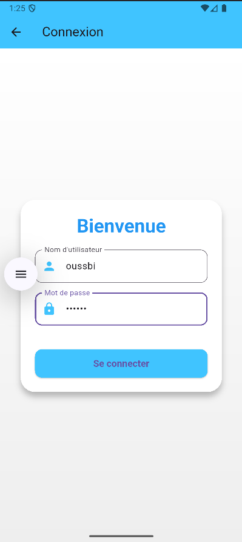
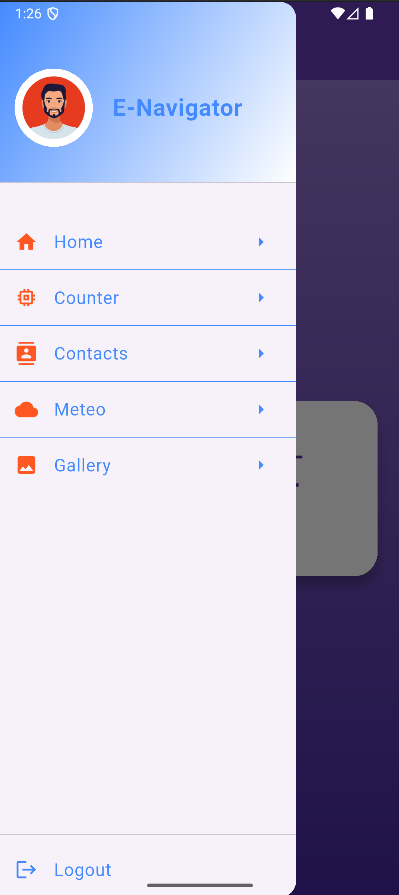
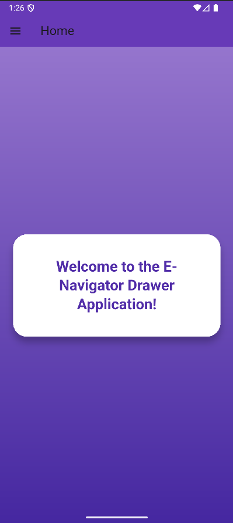
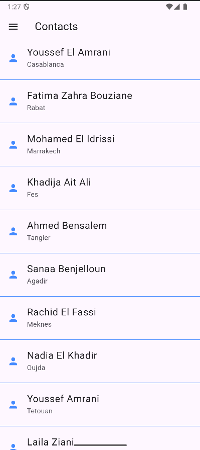
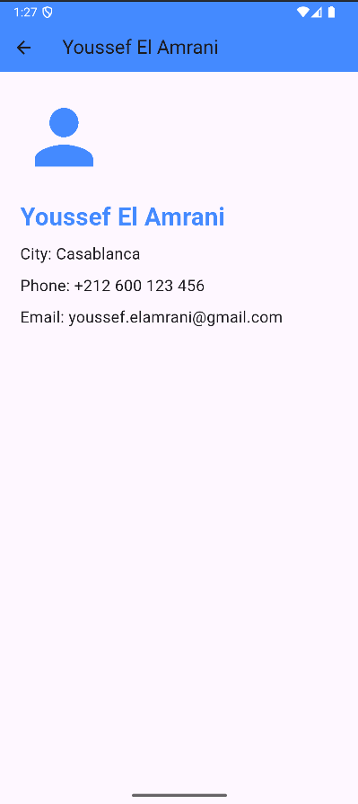
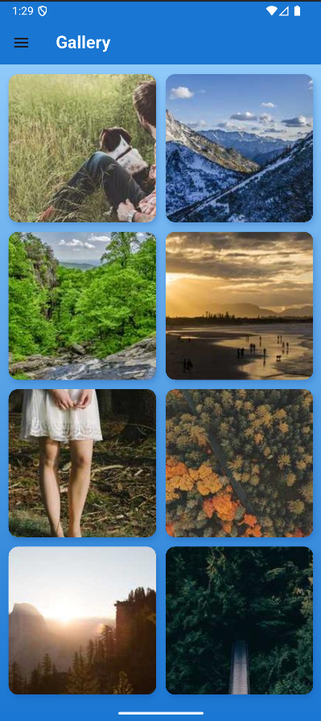
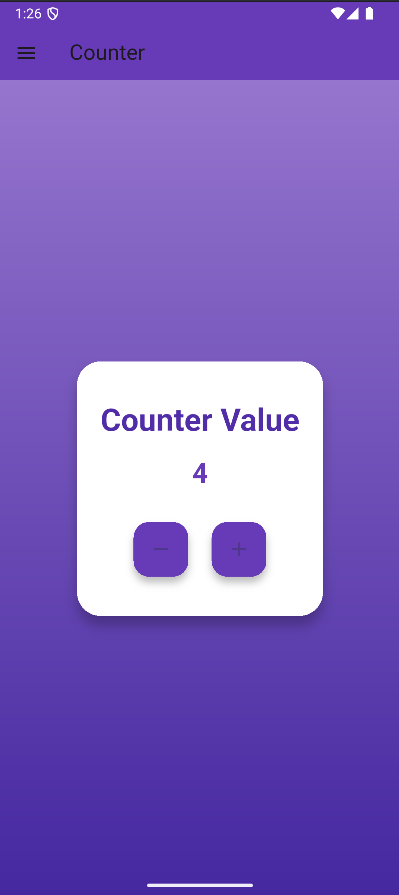
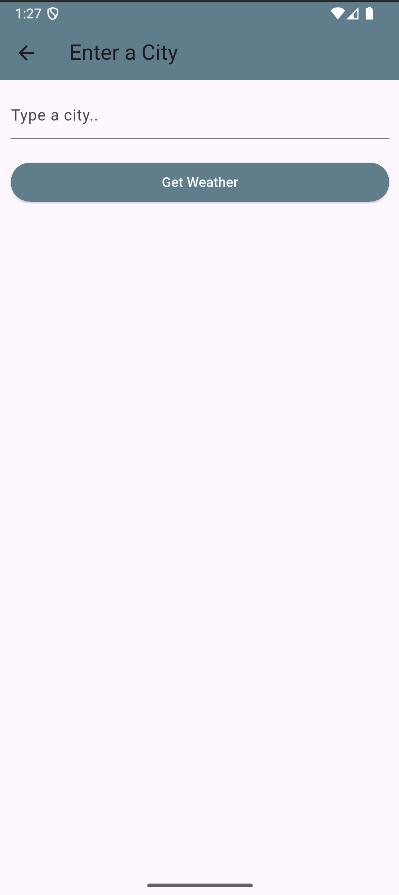
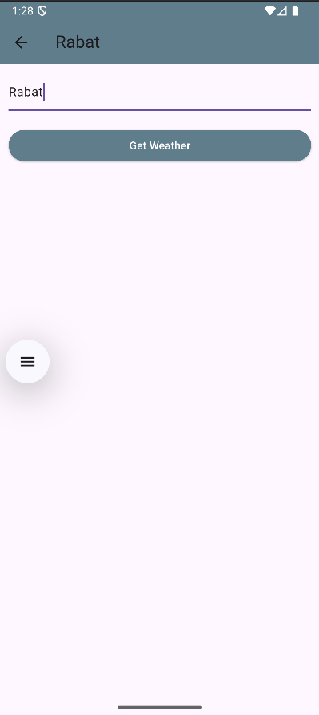
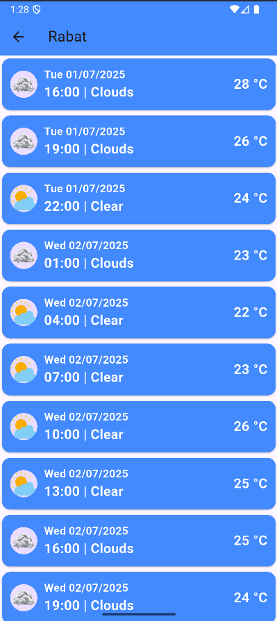

# 🌦️ E-Navigator Drawer App avec Authentification et Météo

Ce dépôt contient une **application mobile Flutter** avec système d’**authentification simple**, un **menu drawer personnalisable**, et une **affichage météo** récupérée via l’API **OpenWeatherMap**.  
Ce projet a été réalisé pour apprendre la gestion d’état avec `Provider`, la navigation, et la consommation d’API externes.Il s’inscrit dans le cadre du module de **Développement Mobile Multiplatforme** encadré par **Mr JAMAL MAWANE**.


---

## 🎯 Objectifs du projet

- 🔐 Gérer l’authentification utilisateur (login/logout)
- 🗂️ Implémenter un menu drawer dynamique avec navigation
- 🌍 Afficher la météo sur 5 jours pour une ville donnée via OpenWeatherMap
- 🎨 Créer une UI propre et fluide avec Material Design

---

## 📂 Structure du projet Flutter
```
├── lib/
│ ├── main.dart # Point d’entrée et routing
│ ├── providers/
│ │ └── auth_provider.dart # Gestion auth avec Provider
│ ├── widgets/
│ │ ├── my_drawer.dart # Menu drawer personnalisé
│ │ ├── weather.dart # Widget affichage météo
│ │ └── weather_form.dart # Formulaire de saisie ville
│ ├── pages/
│ │ └── login.page.dart # Page de connexion
│ │ └── counter.page.dart # Page de counter app
│ │ └── gallery.page.dart # Gellerie d'images
│ │ └── contacts.page.dart # Liste des contacts
│ │ └── home.page.dart # Page d'acceuil
│ │ └── meteo.page.dart # Page de météo
│ └── global/
│ └── global_parameters.dart # Menus & routes
```


---

## 🛠️ Technologies utilisées

- **Flutter** & **Dart**
- **Provider** pour la gestion d’état
- **http** pour les requêtes API REST
- **intl** pour la gestion des dates et formats
- **Material Design** pour l’interface utilisateur

---

## ✅ Fonctionnalités principales

- 🔐 **Authentification simple** avec identifiants codés en dur
- 🗂️ **Menu drawer** avec navigation vers différentes pages
- 🌤️ **Affichage météo** 5 jours avec icônes locales
- 🎨 Transitions animées entre pages
- 🔄 Gestion des états via `ChangeNotifier` et `Provider`

---

## ⏵ Guide d’utilisation

### 🔐 Identifiants de connexion

Pour accéder à l’application, utilisez :

- **Nom d’utilisateur** : `oussbi`
- **Mot de passe** : `123456`

Ces identifiants sont valides uniquement pour cette démonstration.

### 🔧 Configuration de l’API météo

L’API OpenWeatherMap est appelée avec une clé **hardcodée** dans le widget météo (`weather.dart`).  
Pour une utilisation réelle, remplacez la clé par votre propre clé API dans la variable `url` :

```dart
String url = 'https://api.openweathermap.org/data/2.5/forecast?q=${widget.city}&appid=VOTRE_API_KEY&units=metric';
```

---

## ▶️ Instructions d’exécution

1. **Cloner le projet** :
   ```bash
   git clone https://github.com/ouss-issib/navigator_drawer.git
   cd navigator_drawer

2. **Installer les dependences Flutter** :
   ```bash
   flutter pub get

3. **Lancer l'application** :
   - Ouvrir dans Android Studio ou VS Code
   - Lancer un émulateur ou brancher un smartphone Android
   - Appuyer sur Run ou exécuter :
   ```bash
   flutter run

## 📸 Captures d’écran

| Login | Credentials | Drawer Menu |
|---|---|---|
|  |  |  |

| Home | Logout |
|---|---|
|  |  |

| Contacts | Details | Gallery | Counter |
|---|---|---|---|
|  |  |  |  |

| City Selection | Rabat Screen | Weather |
|---|---|---|
|  |  |  |

